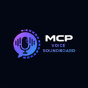

<p align="center">
  
</p>

# Soundboard

> Part of [MCP Tool Shop](https://mcptoolshop.com)


A .NET SDK and reference client for streaming voice engines.

> **Two things live here:** a standalone SDK (`Soundboard.Client`) and a MAUI desktop app that demonstrates it. The SDK is the product. The app is a reference integration.

## SDK quick start

```bash
dotnet add package Soundboard.Client
```

```csharp
using Soundboard.Client;
using Soundboard.Client.Models;

await using var client = new SoundboardClient();
var presets = await client.GetPresetsAsync();
var voices = await client.GetVoicesAsync();

var progress = new Progress<AudioChunk>(chunk =>
{
    // Feed chunk.PcmData to your audio output
});

await client.SpeakAsync(
    new SpeakRequest("Hello from the SDK.", presets[0], voices[0]),
    progress);
```

No MAUI dependency. Works in console apps, WPF, ASP.NET, or anything targeting .NET 8+.

## Architecture

```
This repository
+------------------------------------------+
|                                          |
|  Soundboard.Client (SDK)     net8.0      |  <-- The product
|  Soundboard.Maui.Audio       net8.0      |  <-- NAudio adapter (Windows)
|  Soundboard.Maui             net10.0     |  <-- Reference client (MAUI)
|  soundboard-cli              net8.0      |  <-- Reference client (console)
|                                          |
+------------------------------------------+
            |  HTTP + WebSocket
            v
+------------------------------------------+
|  voice-soundboard (engine repo)          |
|  Any engine implementing the contract    |
+------------------------------------------+
```

The SDK speaks the [API contract](docs/api-contract.md). Any compliant engine works.

## Project structure

```
src/
  Soundboard.Client/         SDK — pure C# (net8.0, zero UI deps)
  Soundboard.Maui.Audio/     NAudio PCM16 playback adapter (Windows)
  Soundboard.Maui/           Reference client — MAUI desktop app
  soundboard-cli/            Reference client — console app

examples/
  Quickstart/                Zero-config "hello world" → WAV file
  AgentTool/                 SDK as a callable tool in an agent pipeline

tests/
  Soundboard.Client.Tests/         27 unit tests (no engine required)
  Soundboard.IntegrationTests/     17 integration + contract tests

docs/
  api.md                     SDK API reference v1.0
  api-contract.md            Engine <-> SDK protocol spec
  compatibility.md           SDK-engine compatibility matrix & trust contract
  getting-started-sdk.md     SDK integration guide
  streaming-model.md         How audio streaming works
  error-model.md             Failure modes and handling
  feature-map.md             Feature-to-layer mapping
  known-limitations.md       Current boundaries
  evaluation-guide.md        How to evaluate Soundboard
```

## Run the reference client

```bash
# Prerequisites: .NET 10.0 SDK with MAUI workload, Windows 10/11

git clone https://github.com/mcp-tool-shop-org/soundboard-maui.git
cd soundboard-maui

# Run tests (no engine needed)
dotnet test

# Build and run the MAUI app
set SOUNDBOARD_BASE_URL=http://localhost:8765
dotnet run --project src/Soundboard.Maui
```

## Run the CLI client

```bash
# Check engine health
dotnet run --project src/soundboard-cli -- health

# List available presets
dotnet run --project src/soundboard-cli -- presets

# Speak text (streams to WAV file)
dotnet run --project src/soundboard-cli -- speak "Hello world" --preset narrator
```

## FAQ

**What is the SDK?**
`Soundboard.Client` is a standalone .NET 8 library that handles all engine communication — health checks, discovery, and streaming speech over WebSocket. Reference it from any .NET project.

**What is the MAUI app?**
A reference client that demonstrates the SDK with a desktop UI. It is not the product — it shows one way to use the SDK.

**Is this production-ready?**
The SDK API (v1.0) is stable. The MAUI app is demo-grade. See [known limitations](docs/known-limitations.md).

**Can I build my own UI?**
Yes. That is the point. The SDK has zero UI dependencies. Implement `IAudioPlayer` for your platform and go.

**Where does the engine live?**
In a separate repository: [voice-soundboard](https://github.com/mcp-tool-shop-org/voice-soundboard). This repo contains zero engine code.

## Examples

| Example | What it shows |
|---|---|
| [Quickstart](examples/Quickstart/) | Connect, speak, save WAV — 30 seconds |
| [Agent Tool](examples/AgentTool/) | SDK as a callable tool in an AI agent pipeline |

## Documentation

- [Getting started with the SDK](docs/getting-started-sdk.md)
- [Streaming model](docs/streaming-model.md)
- [Error model](docs/error-model.md)
- [API reference](docs/api.md)
- [API contract](docs/api-contract.md)
- [Compatibility & trust](docs/compatibility.md)
- [Engine setup](docs/engine-setup.md)
- [Upgrade & rollback playbook](docs/upgrade-playbook.md)
- [Publishing the SDK](docs/publishing.md)
- [Fresh install validation](docs/fresh-install.md)
- [Evaluation guide](docs/evaluation-guide.md)
- [Changelog](CHANGELOG.md)
- [Contributing](CONTRIBUTING.md)

## Related

- [Engine repository](https://github.com/mcp-tool-shop-org/voice-soundboard)
- [Known limitations](docs/known-limitations.md)
